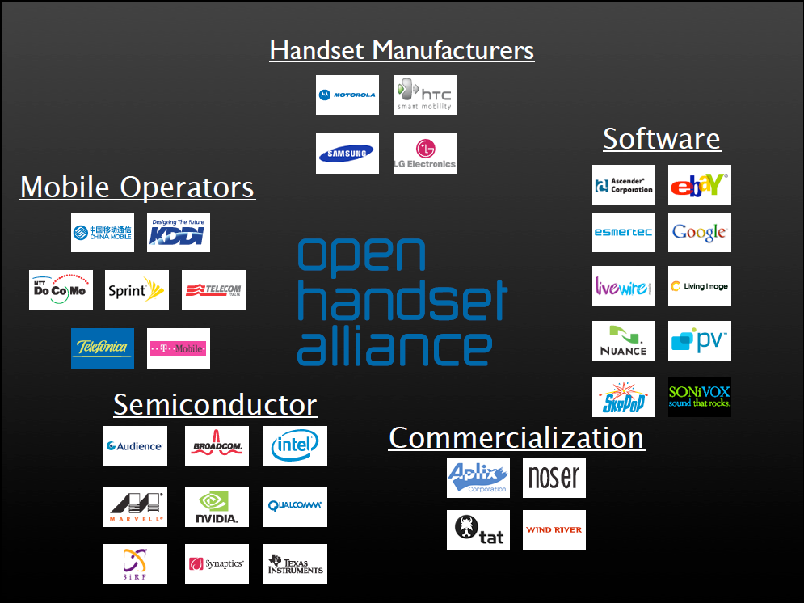
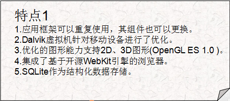

# Android的发展与历史
---
**Android系统的产生**
* 安迪鲁宾是一位硅谷著名的极客，他曾先后在苹果、General Magic、WebTV等公司工作，2000年参与创办了Danger公司。该公司生产的Hiptop(T-Mobile Sidekick)智能手机具备上网、全键盘和照相功能，2003年曾在美国风行一时。
    离开Danger之后，安迪鲁宾创办了新的公司，致力于研发手机操作系统。因为Linus Torvalds把自己写的操作系统称为Linux，安迪鲁宾的名字是Andrew（Andy为Andrew 的昵称），再加上他本身是个机器人迷，所以新公司取名叫做Android。

* 2005年7月，成立仅22个月的Android公司被急于开拓无线互联网业务的Google收购，安迪鲁宾也随 Android加入了Google,继续领导手机操作系统的开发。也就是从这个时候起，业界就开始盛传Google（Google）公司将进军移动通信市场，并推出自主品牌的移动终端产品。更有人将其与苹果公司刚刚推出的iPhone相提并论，取名为“Gphone”，而网络上关于Gphone的各种猜想图片也是满天飞。
* 在沸沸扬扬传了两年多，经过无数次的媒体报道和猜测之后，2007年11月5日Google终于公布了答案，令人意外地是并没有出现传说中的Google Phone或GPhone。Google宣布与其他33家手机制造商(包含摩托罗拉、宏达电、三星、LG)、手机芯片供货商、软硬件供货商、电信运营商(包括中国移动)联合组成开放手机联盟(Open Handset Alliance)，发布了名为Android 的开放手机软硬件平台。
* 2008年9月23日，Google与美国电信运营商T-Mobile联合在纽约正式发布第一款Google手机——T-Mobile G1。该款手机由HTC制造，内部研发代号为Dream（中文含义：梦想），是世界上第一部搭载Android操作系统的手机。

**开放手机联盟(Open Handset Alliance)**
* 开放手机联盟，Open Handset Alliance：是美国Google 公司与2007 年11 月5 日宣布组建的一个全球性的联盟组织。
* 联盟将会支持Google 发布的Android 手机操作系统或者应用软件，共同开发名为Android 的开放源代码的移动系统。
* 开放手机联盟包括手机制造商、手机芯片厂商和移动运营商几类。目前，联盟成员数量已经达到了43 家。

**Android特点及优势**
* Android底层构建在 Linux 2.6内核上。
* Android软件系列包括操作系统、中间件、用户界面和应用软件。

**Android平台版本的演化发展**

Android平台更新速度非常惊人，这给应用开发带来了很大的麻烦，也给硬件厂商带来很多不便。

