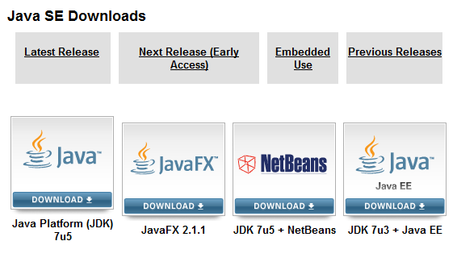
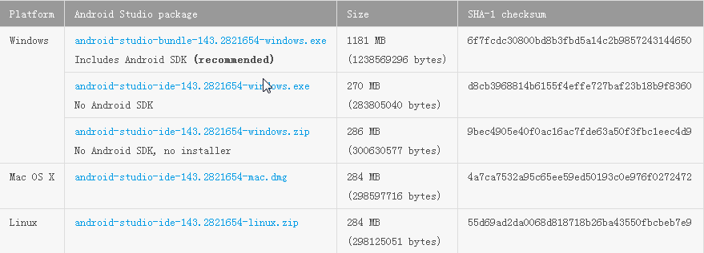
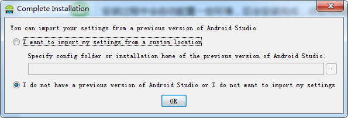
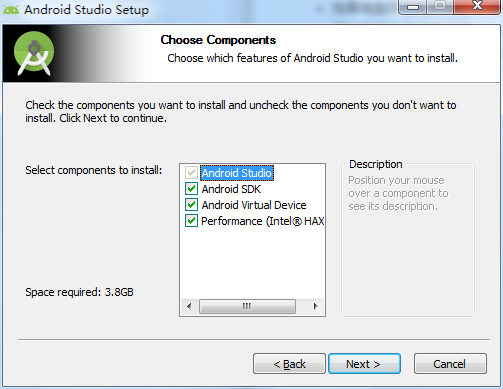
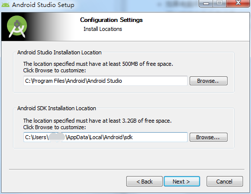
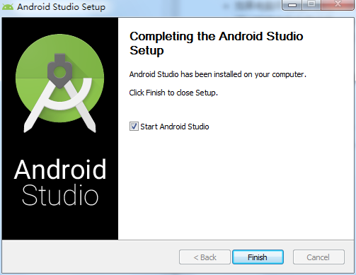
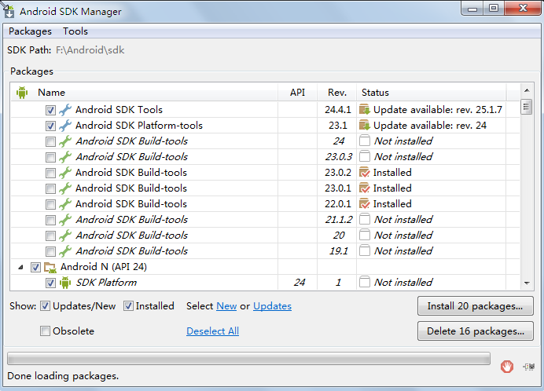
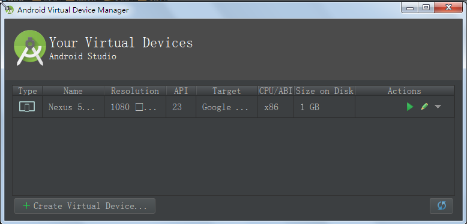
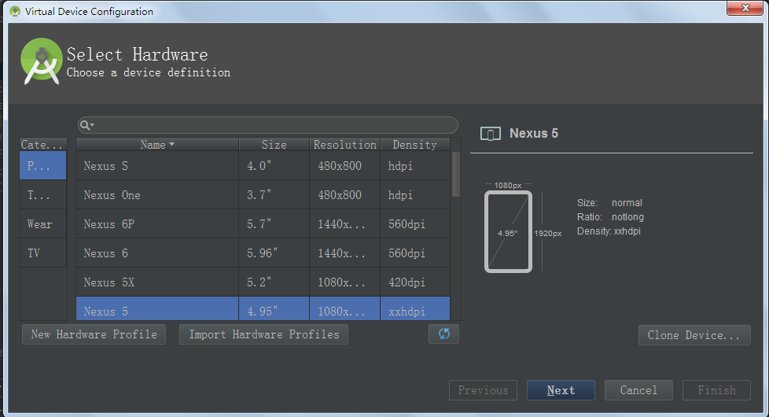
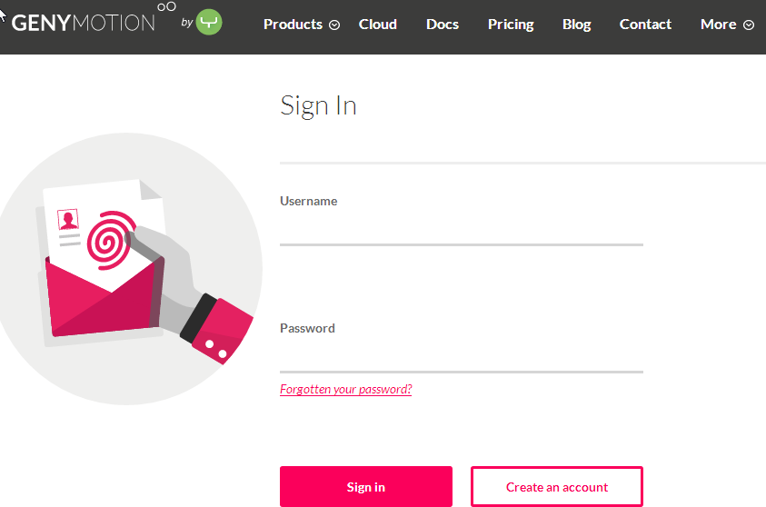

# 搭建Android开发环境
---
##JDK安装与环境配置
* JDK下载：选择 Java Platform(JDK) 只下载JDK，无需下载jre
http://www.oracle.com/technetwork/java/javase/downloads/index.html

* 环境配置：属于入门知识，这里不再叙述。

## 安装Android Studio
* 登录http://developer.android.com/sdk/index.html 根据系统版本下载压缩包。

* (1)将压缩包解压到任意盘符的根路径下，然后单击解压路径下bin目录下的exe文件：
如果如果是之前安装过老版本的Android Studio，选择第一个，第一次安装默认选择即可；否则选择第二个。

* 进入安装界面，选择需要安装的组件：1.必选；2.SDK；3.虚拟机；4.虚拟机加速程序。选择后点击“Next”。

* 选择Android Studio 和SDK 的安装目录：

* 完成SDK 的下载，点击Finish:

* 由于Android Studio是基于IntelliJ IDEA的IDE工具，因此Android Studio中Project(项目)的概念与Eclipsede的 Project概念不同，Android Studio项目相当于Eclipse的WorkSpace(工作空间)，Android Studio的Module(模块)才相当于Eclipse的项目。

##升级Android SDK
虽然安装Android Studio时已经附带安装了Android SDK,但往往不是最新版的。因此还需重新下载最新的Android SDK。
* 登录 http://developer.android.com/sdk/index.html下载需要的安装包，下载完成后解压到任意路径下。
* 启动SDK Manager.exe,勾选需要安装的平台和工具

##安装运行、调试环境
* 条件优先，优先考虑购买Android真机（真机调试的速度更快，效果更好）
* 配置Android虚拟设备（AVD）
 * 进入Android Virtual Devices Manager，点击下面“Create Virtual Device”
  
 * 进入如下界面后，根据需求自定义选择创建自己的模拟器：
 
 

* 使用第三方提供的Genymotion模拟器。
 * 登录 http://www.genymotion.com/#!/download站点选择合适的版本下载：
 
 * 注册该网站账号后，下载文件。
 * 安装Genymotion时会自动安装Oracle的VirtualBox,点击“Next”即可完成安装。
 * 打开Genymotion，点击“Add”添加模拟器设备。
 * 打开“Preferences”，从“Plugins”下载Genymotion插件。

